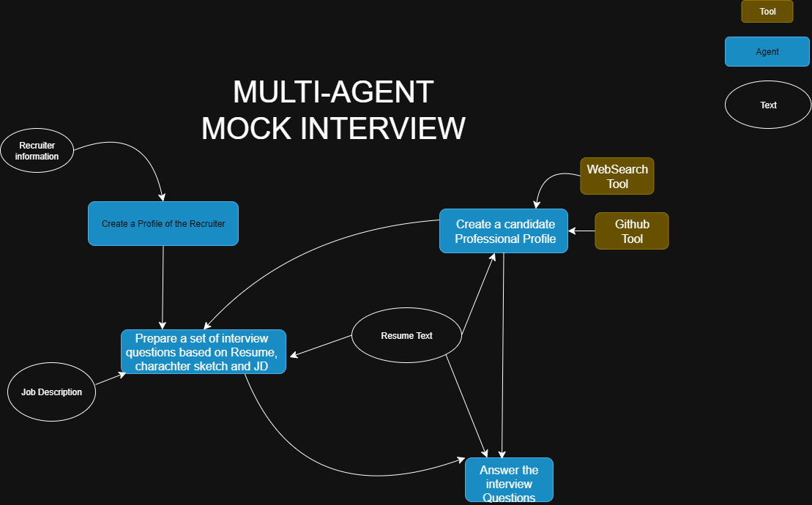

# 🧑‍💻 Multi-Agent Mock Interview Simulation using CrewAI

## Overview

This project simulates a **technical interview process** using autonomous AI agents orchestrated with [CrewAI](https://github.com/joaomdmoura/crewai).  
It showcases how multiple agents can collaborate to mimic real-life recruiter-candidate interactions in an automated workflow.

---


## 🧩 Agents and Roles

| Agent | Role | Purpose |
|------|------|---------|
| **Recruiter Research Analyst** | Researcher | Analyzes recruiter profiles and extracts key characteristics. |
| **Candidate Research Analyst** | Researcher | Analyzes candidate resumes and GitHub profiles for skills and experience. |
| **Mock Interviewer** | Interviewer | Generates interview questions based on recruiter style and job description. |
| **Mock Candidate** | Candidate | Provides thoughtful answers imitating the candidate. |

---

## 📝 Tasks

1. **Recruiter Research Task**  
   Extracts a character profile of the recruiter from provided input.

2. **Candidate Research Task**  
   Analyzes the candidate’s resume and GitHub to build a skills profile.

3. **Interview Question Generation Task**  
   Creates a list of at least **10 challenging interview questions** tailored to the recruiter’s style and job description.

4. **Candidate Answer Task**  
   Answers the generated questions in the style of the candidate based on the analyzed resume and profile.

---

## 🛠 Tools Used

- **CrewAI** — Multi-agent orchestration framework.
- **OpenAI API** — For language model-based reasoning.
- **Serper.dev API** — Search integration.
- **GitHubSearchTool** — To analyze GitHub profiles.
- **ScrapeWebsiteTool** — For additional web-based information retrieval.

---


---

## ⚙️ How It Works

1. **Input Provided:**
   - Recruiter summary text
   - Candidate resume text
   - Candidate GitHub profile URL
   - Job description text

2. **CrewAI Orchestration:**
   - Agents execute tasks with context sharing.
   - Sequential and dependent execution to simulate interview flow.

3. **Final Output:**
   - Recruiter character profile
   - Candidate profile
   - Interview questions
   - Candidate’s answers

---

## 🚀 Running the Project

1. **Install Dependencies:**
   ```bash
    pip install crewai crewai-tools openai
2. Make sure to add your github token, resume text, Recruiter info and the Job description in relevent spaces
3. Run the python file. You will be able to see the thaught and execution process of the agents.


